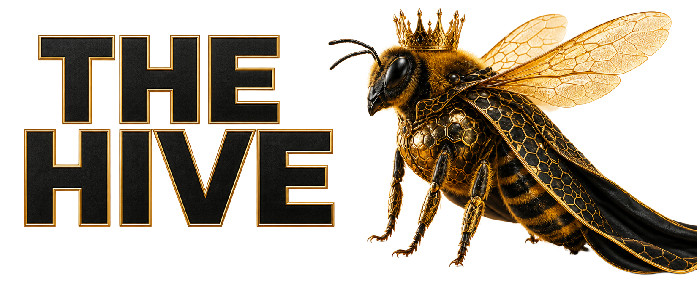

<div align="center">



# Vibe Coding Tools

### Get the Git life.

**75 specialist agents, 78 skills, commands, hooks, and rules for Claude Code, Cursor, Codex, and Cowork.**

I call it The Hive. Your coding assistant stops being one guy guessing and starts being a whole crew that already knows the job.

</div>

<div align="center">

<a href="https://www.ospry.ai">
  <picture>
    <source media="(prefers-color-scheme: dark)" srcset="https://raw.githubusercontent.com/legioncodeinc/brands/main/ospry/logos/png/core-assets/transparent/horizontal-white-1024.png">
    <source media="(prefers-color-scheme: light)" srcset="https://raw.githubusercontent.com/legioncodeinc/brands/main/ospry/logos/png/core-assets/transparent/horizontal-ink-1024.png">
    
  </picture>
</a>

<sub>Want to know what will actually drive more revenue? <strong><a href="https://www.ospry.ai">OSPRY</a></strong> is the insight engine built for exactly that.</sub>

</div>

---

## The problem this fixes

Your AI assistant is smart and has no memory. Every task starts the same way. You explain the stack. You repeat your standards. You name the tools you like. You remind it to check security, and then you hope it did. Ten prompts later you are still typing the same context you typed yesterday.

That tax never goes away on its own. You either pay it forever or you build the context once and make it permanent. The Hive is that context, built once and wired into four different coding tools so it follows you around.

Here is what you actually get. 75 Bees, which are specialist agents that each own one job. 78 Stingers, which are the skills those specialists read before they touch anything. Two commands that route work and drive it to done. Four rules and two hooks that turn your standards into things the machine checks instead of things you nag about. And a Library system that gives your project a real memory.

The point is not more AI output. Anybody can generate more code. The point is fewer wrong turns, fewer skipped checks, and work you can actually grade against something you wrote down.

## Start here

The fastest first win takes about two minutes. Open the repo you want to fix and give your assistant this:

```text
Use get-started-stinger to set up this repository with the Library Schema v2 structure.
Inspect what already exists, preserve it, create only what is missing,
and give me the final setup report.
```

It reads what you already have, leaves your work alone, and builds only the missing pieces. You get a report at the end listing what it made and what still needs a human to decide. Read that report before you accept anything.

After that, four folders do the heavy lifting. Durable facts go in `library/knowledge/`. Planned work goes in `library/requirements/`. Bugs and incidents go in `library/issues/`. Scratch notes go in `library/notes/`. Your agent reads those folders the same way a new teammate would read a wiki, except it actually does.

[Read the full getting started guide](learn/guides/GETTING-STARTED.md).

## How The Hive works

Every piece has one job. That is the whole design.

| Piece | Plain English | What it does |
|---|---|---|
| **Bee** | A specialist agent | Owns one domain and makes the calls in it |
| **Stinger** | The Bee's skill | The playbook, examples, templates, and research it reads first |
| **Beekeeper** | The router | Picks the right Bee and hands it the matching Stinger |
| **Smoker** | The closer | Drives a PRD through build, security, quality, and shipping |
| **Rule** | Always on | Boundaries every worker stays inside |
| **Hook** | The enforcer | Checks real actions before or after a tool runs |

Every Bee is paired with exactly one Stinger. That pairing is the rule that makes this work. A Bee without its Stinger is a smart agent with amnesia, so a Bee that gets dispatched without loading its skill is a failed dispatch and it starts over.

Three skills break that rule on purpose because they run the show instead of doing the work: `beekeeper-suit` routes, `queen-bee-stinger` builds new components, and `get-started-stinger` sets up repos. The full roster of all 75 pairs lives in the [Asset Catalog](learn/ASSET-CATALOG.md).

## Nothing ships without passing the gate

This is my favorite part and it is the part most AI setups skip.

Before any code gets committed, it runs `security-stinger` first, then `quality-stinger`, then `github-repo-health-stinger`. Each pass writes a real report into `library/`. Anything rated medium or worse gets fixed, and then the whole thing gets re-checked, not spot-checked. You review the reports and you approve the commit. Not the agent. You.

Security runs before quality for a reason that took me a while to appreciate. A security fix changes the code, and changed code invalidates whatever quality just signed off on. Run them backwards and your QA report is a lie.

## Pick your tool

**Claude Code.** Everything lives in [`.claude/`](.claude/). Point it at the folder and go:

```powershell
claude --plugin-dir .claude
```

Then use `/the-beekeeper` to route a task or `/the-smoker` to run the whole delivery line.

**Cursor.** Open the repo. That is it. The [`.cursor/`](.cursor/) tree has 75 agents, 78 skills, 2 commands, 4 MDC rules, and hooks already in place.

**Codex.** A plain clone works with no install. [`.agents/skills/`](.agents/skills/) has all 80 repo skills, [`.codex/agents/`](.codex/agents/) has 75 native TOML agents, and the config and hooks are wired. Call the workflows directly:

```text
$the-beekeeper route this task to the right specialists
$the-smoker execute these PRDs through verified completion
```

There is also an installable plugin at [`.codex/plugins/vibe-coding-tools/`](.codex/plugins/vibe-coding-tools/) for Codex CLI and the ChatGPT desktop app. The project adapter stays separate because installing a plugin does not install repo agent TOMLs.

**Claude Cowork.** Open Customize in the sidebar, go to Plugins, upload `learn/packages/vibe-coding-tools-claude-code-1.0.0.zip`. Same package format as Claude Code.

Prebuilt archives and SHA-256 checksums for all four are in [`learn/packages/`](learn/packages/).

## Why documents, not just code

Code tells you what the machine does right now. It does not tell you why anybody chose that, what it should do next, or what has to be true before you call it finished. That stuff lives in someone's head until they leave, and then it does not live anywhere.

So this system treats docs as working memory instead of homework. Knowledge files hold the domain truth that would otherwise die in a Slack thread. ADRs hold the reasoning behind expensive decisions so nobody relitigates them in six months. PRDs turn a vague idea into goals, non-goals, and acceptance criteria an agent can actually execute against. IRDs give a bug a traceable problem, cause, fix, and proof.

An agent with no context guesses well and confidently. An agent with your project knowledge and a written definition of done works like somebody who already had the meeting.

## Learn the system

- [Agents and Bees](learn/guides/AGENTS.md)
- [Skills and Stingers](learn/guides/SKILLS.md)
- [Commands](learn/guides/COMMANDS.md)
- [Product Requirements Documents](learn/guides/PRODUCT-REQUIREMENTS-DOCUMENT.md)
- [Library Structure](learn/guides/LIBRARY-STRUCTURE.md)
- [Hooks](learn/guides/HOOKS.md)
- [Rules](learn/guides/RULES.md)
- [Model Selection](learn/guides/MODEL-SELECTION.md)
- [Security and Secrets](learn/guides/SECURITY-AND-SECRETS.md)
- [Harness Compatibility](learn/guides/HARNESS-COMPATIBILITY.md)
- [Troubleshooting](learn/guides/TROUBLESHOOTING.md)

## Building on it

The `.claude/` tree is the source of truth. Everything else is generated from it. Change an agent, skill, command, or hook, then run:

```powershell
python learn/scripts/generate-harnesses.py
```

That rebuilds the Cursor mirror, the Codex agents, the repo skills, the plugin skills, and the catalog. Do not hand-edit the generated trees. You will lose the change on the next build and spend an hour wondering why.

Want to add your own Bee and Stinger? `queen-bee-stinger` runs the seven stage forge: Topic, Research, Distillation, References, Guides, Skill File, Register. It does real research and archives the sources, so the skill you get is grounded instead of guessed. That is the same pipeline every skill in here went through.

## License and attribution

Vibe Coding Tools is source-available software created by **Mario Aldayuz and [Legion Code Inc.](https://www.legioncodeinc.com)**

Use it personally, at work, in your business, and as a tool inside paid services. Do not sell the Work itself, do not strip the attribution, do not pass it off as yours. Full terms in [LICENSE.md](LICENSE.md).

Built for vibe coders. Go ship something.

---

<div align="center">

<picture>
  <source media="(prefers-color-scheme: dark)" srcset="https://raw.githubusercontent.com/legioncodeinc/brands/main/legion-code-inc/logos/legion-symbol-dark.svg">
  <source media="(prefers-color-scheme: light)" srcset="https://raw.githubusercontent.com/legioncodeinc/brands/main/legion-code-inc/logos/legion-symbol-light.svg">
  
</picture>

<sub><strong>We are Legion. Vibe with Legion.</strong></sub>

</div>
